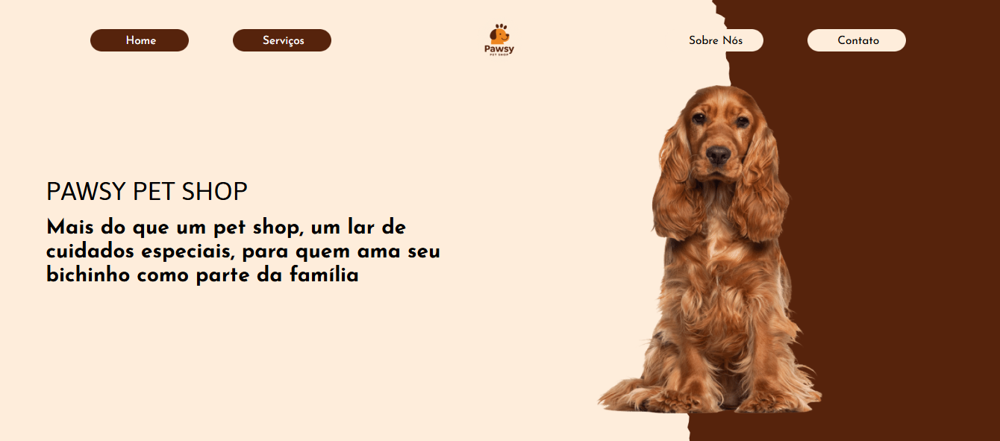
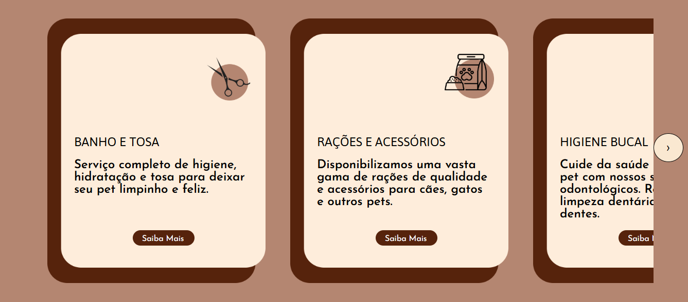
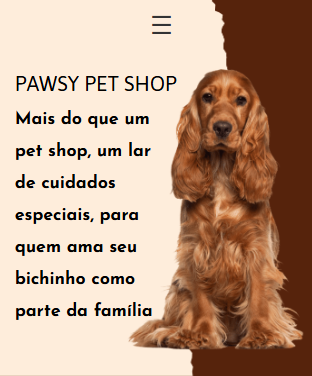

# PawsyPage
Este projeto foi gerado com o Angular CLI versão 17.3.16.

# Servidor de desenvolvimento
Execute ng serve para iniciar o servidor de desenvolvimento. Acesse http://localhost:4200/. A aplicação será recarregada automaticamente se você modificar qualquer um dos arquivos-fonte.

# 🐾 Sobre o projeto - PawsyPage
PawsyPage é uma aplicação web desenvolvida com Angular voltada para um pet shop fictício chamado Pawsy, que oferece produtos e serviços com carinho e dedicação aos pets e seus tutores. O objetivo da plataforma é apresentar a marca, seus valores e serviços de forma moderna, responsiva e encantadora.

# ✨ Funcionalidades:
Layout responsivo para garantir uma boa experiência tanto em desktop quanto em dispositivos móveis.
Seção de cards interativos com imagens e descrições.

# Visual

